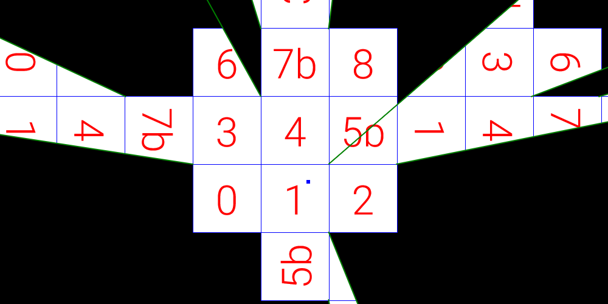

# non-euclidean-grid

An interactive demo that renders a non-Euclidean 2D grid.

[Demo](https://dennis.life/demo/non-euclidean-grid/)
[Blog Post](https://blog.dennis.life/2020/08/05/non-euclidean-grid/)



## Building

Building requires [Node.js](https://nodejs.org/), the TypeScript compiler (`npm install -g typescript`), Pug (`npm install -g pug`), and Sass (`npm install -g sass`).

* Build HTML with: `pug index.pug`
* Build SASS with: `sass style.sass style.css --no-source-map --style compressed`
* Build TypeScript with: `tsc index.ts`

Finally, the JavaScript file on the demo website is further optimized with the [Closure Compiler](https://developers.google.com/closure/compiler). This is not necessary, but can be performed as follows:
```
closure-compiler --js index.js --js_output_file index.min.js
```
Otherwise, rename `index.js` to `index.min.js` (as the HTML file references the file by that)

## License
BSD-3 - See the `LICENSE` file
